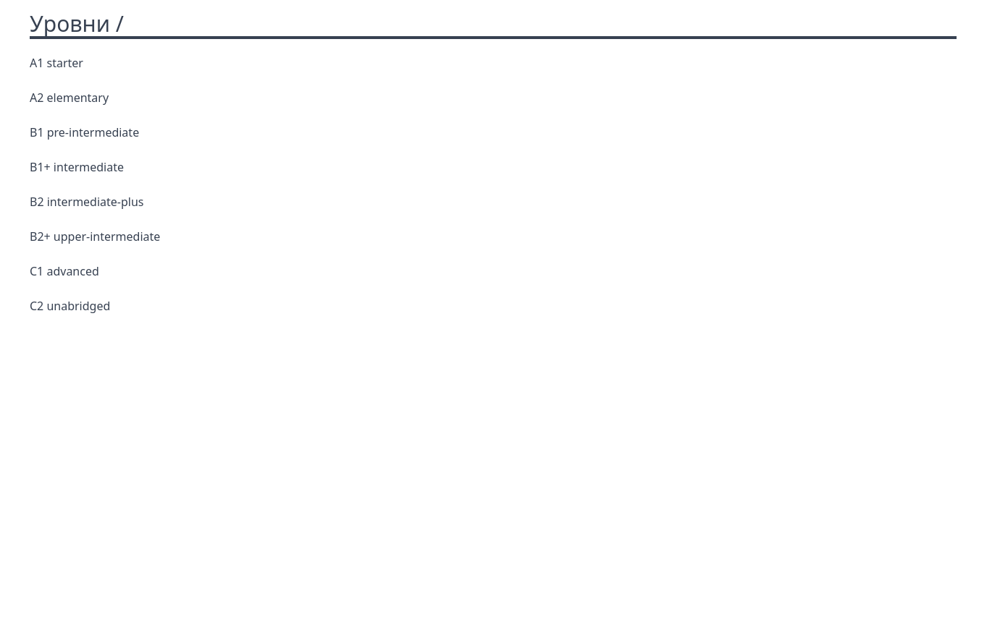

# Web-приложение для создания файлов в формате FB2 с оригинальным текстом и переводом

## Установка

```
git clone https://github.com/golubtsov/web-app-fb2-translate.git
```

Скопировать ``.env``.

```
composer i
npm i
npm run dev
```

Из контейнера

```
php artisan migrate
php artisan app:load-books // Команда загружает книги
```

```
php artisan app:clear-translations // Команда очищает переводы и zip-архивы в папке ./storage/app/public/*
```

## Использование

Загружаем в базу информацию о тех книгах, которые есть на этом сайте https://english-e-reader.net/ .
При нажатии на кнопку ``Создать перевод`` получаем текст книги в FB2 формате (оригинал) и TXT (для перевода).
Создаем перевод и сохраняем эти два файла в ``/storage`` и создаем из них zip-архив для скачивания.

Главная страница



Страница с уровнем подготовки


Создать перевод


Перевод создан


После создания перевода книги


